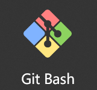
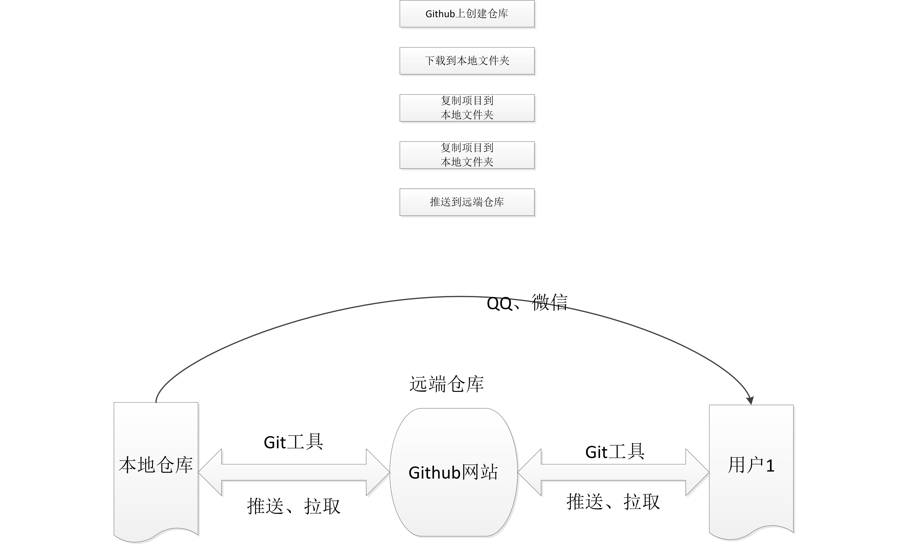

# VSCode和CodeGeeX插件

- 使用VSCode的原因：
  - VSCode是微软推出的免费开源编辑器，支持多种语言，功能强大，社区活跃，插件丰富。
  - VSCode的插件系统非常强大，可以方便地扩展编辑器的功能。
  - VSCode的跨平台性，可以在Windows、Mac和Linux上运行。
- 使用CodeGeeX插件的原因：
  - CodeGeeX插件是清华大学KEG实验室开发的AI编程助手，可以提供代码补全、代码生成、代码翻译等功能。
  - CodeGeeX插件可以大大提高编程效率，减少重复劳动，提高代码质量。
  - CodeGeeX插件可以提供多种编程语言的支持，包括Python、Java、C++等。

## 安装

1. 打开VSCode，点击左侧的扩展图标（或者按`Ctrl+Shift+X`）。
2. 在搜索框中输入`CodeGeeX`，点击搜索结果中的`CodeGeeX`插件，然后点击`安装`按钮。
3. 安装完成后，重启VSCode。

## CodeGeeX插件的主要功能

1. 代码补全：根据当前代码上下文，自动补全代码片段。
2. 代码生成：根据当前代码上下文，自动生成代码片段。
3. 代码翻译：将代码从一种编程语言翻译成另一种编程语言。
4. 代码注释：自动为代码添加注释。
……

## 基于C++开发的烟花效果项目

原始项目：有画面没声音

二次开发：添加烟花绽放音效

## 项目展示

## 开发步骤

询问AI代码添加在什么位置？如何修改代码……

## 补充内容：git工具与远程仓库的使用

- git工具————————————————
  - 基本使用：
    - git init、
    - git add、
    - git commit、
    - git push
    - git clone +仓库地址
    - git pull
  - **日常学习与练习**：
    - 下载项目；
    - 提交项目到远程仓库
- 远程仓库
  - github——————————————
  - gitee（码云）————————

步骤：

## 添加内容1
